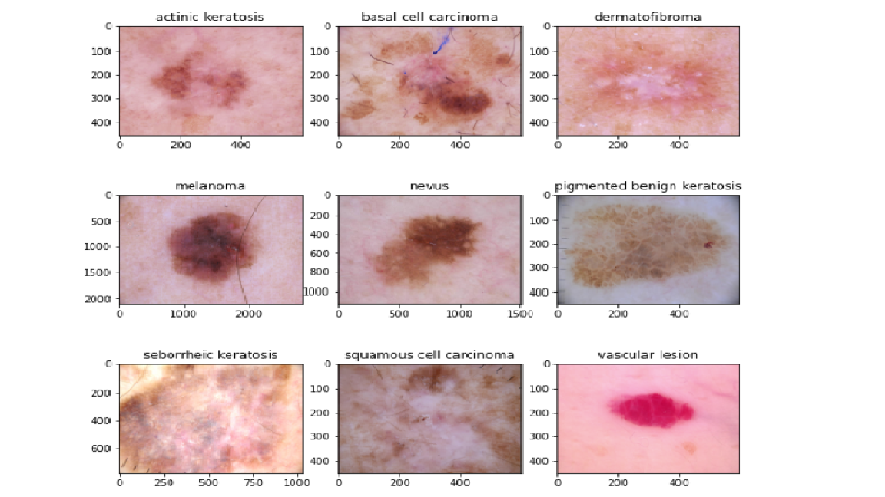

# Machine Learning Portfolio

---

## House Price Prediction

Model the price of houses with the available independent variables. This model will then be used to understand how exactly the prices vary with the variables. They can accordingly manipulate the strategy of the firm and concentrate on areas that will yield high returns. Further, the model will be a good way for management to understand the pricing dynamics of a new market.

The model has also been deployed using Flask and Heroku for making real time predictions.

* Data Understanding
* Exploratory Data Analysis
* Data Preparation
* Lasso Model
* Ridge Model
* Inferences
* Double Alpha and rebuild Lasso and Ridge
* Remove top 5 features from Lasso and rebuild model
* Deploy Model and make real time predictions

## Telecom Churn Case Study

In the telecom industry, customers are able to choose from multiple service providers and actively switch from one operator to another. In this highly competitive market, the telecommunications industry experiences an average of 15-25% annual churn rate. Given the fact that it costs 5-10 times more to acquire a new customer than to retain an existing one, customer retention has now become even more important than customer acquisition. In this project, we will analyze customer-level data of a leading telecom firm, build predictive models to identify customers at high risk of churn.

* Data Understanding
* Exploratory Data Analysis
* Data Preparation
* Principal Component Analysis(PCA)
* Logistic Regression Model with PCA
* Random Forest Model with PCA
* XG Boost Model with PCA
* Random Forest Model without PCA for Feature Importance
* Inference

## Skin Cancer Image Classification

CNN based model which can accurately detect the type of skin cancer out of 9 categories. A solution which can evaluate images and alert the dermatologists has the potential to reduce a lot of manual effort needed in diagnosis. Dataset of about 2357 images of skin cancer types. The dataset contains 9 sub-directories in each train and test subdirectories. The 9 sub-directories contains the images of 9 skin cancer types respectively.

* Data Splitting to Test and Validation
* Data Visualisation(One from each class)
* Model 1 - Build and Analysis
* Model 2 - Build with Data Augmentation and Analysis
* Model 3 - Build with Augmentor and Rectified Class Imbalance

## Gesture Recognition

As a data scientist at a home electronics company which manufactures state of the art smart televisions. We want to develop a cool feature in the smart-TV that can recognise five different gestures performed by the user which will help users control the TV without using a remote.The gestures are continuously monitored by the webcam mounted on the TV. 

Each gesture corresponds to a specific command:
* Thumbs up : Increase the volume.
* Thumbs down : Decrease the volume.
* Left swipe : 'Jump' backwards 10 seconds.
* Right swipe : 'Jump' forward 10 seconds.
* Stop : Pause the movie.

The training data consists of a few hundred videos categorized into one of the five classes. Each video (typically 2-3 seconds long) is divided into a sequence of 30 frames(images). These videos have been recorded by various people performing one of the five gestures in front of a webcam - similar to what the smart TV will use.Design the network in such a way that the model is able to give good accuracy on the least number of parameters so that it can fit in the memory of the webcam.

